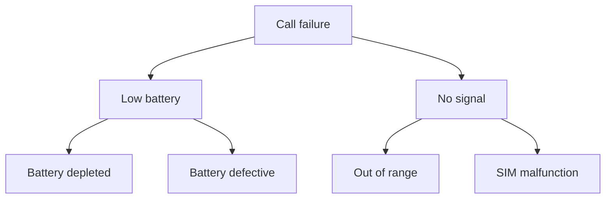

# agent-cellphone-cli

This README is the single source of truth (SSOT) for project information and diagrams.

## Failure Tree

The following Mermaid diagram is the SSOT for failure analysis.

```mermaid
flowchart TD
    Failure[Call failure]
    Failure --> LowBattery[Low battery]
    Failure --> NoSignal[No signal]
    LowBattery --> Depleted[Battery depleted]
    LowBattery --> Defective[Battery defective]
    NoSignal --> OutOfRange[Out of range]
    NoSignal --> SIMIssue[SIM malfunction]
```

