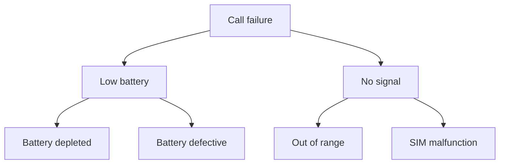

# agent-cellphone-cli

This README is the single source of truth (SSOT) for project information and diagrams.

## Project Overview

Agent Cell Phone CLI replaces GUI-based control with a headless command-line workflow so supervisors can orchestrate agents without input conflicts. The project centers on a Rust executor that enforces policy gates and provides a JSON-RPC interface for file edits, process management, and locking. Python supervisors generate structured instructions and communicate through the executor.

Key features:

- Rust executor with JSON-RPC (stdio) interface
- Python supervisors for strategy and planning
- Messaging bus and observability through logs and traces
- Policy gates for SSOT, deduplication, and a 300-line monolith limit

See `docs/PRD.md` for complete product requirements.

## Failure Tree

The following Mermaid diagram is the SSOT for failure analysis.

